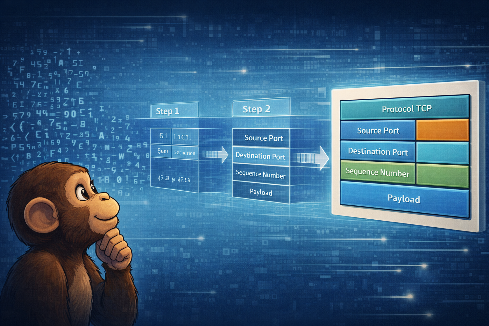
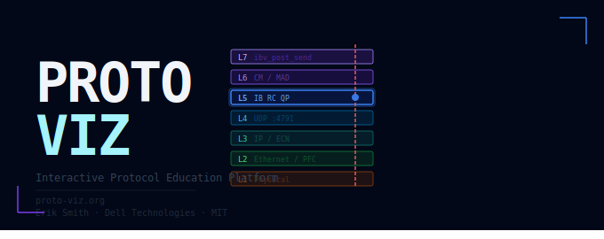

<p align="center">
  
</p>

<p align="center">
  
</p>

<p align="center">
  <strong>Interactive protocol visualization for network engineers, students, and anyone curious about what happens on the wire.</strong>
</p>

[](https://github.com/provandal/protoviz/actions/workflows/deploy.yml)
[](LICENSE)
[](CONTRIBUTING.md)

**Live:** [https://provandal.github.io/protoviz/](https://provandal.github.io/protoviz/)

---

## What is ProtoViz?

ProtoViz is an open-source, browser-based platform that turns protocol exchanges into interactive, step-by-step visualizations. Each scenario is a YAML file describing a complete protocol interaction — from physical link establishment through application-layer operations — with every frame field annotated with spec references and Linux kernel source cross-links.

### Features

- **Animated Sequence Diagrams** — Phase-grouped timeline with play/pause/step and scrubbing
- **OSI Stack Visualization** — Live 7-layer state for each actor, updated per step
- **Wireshark-style Packet Inspector** — Drill into every header field with expandable details, spec references, and kernel source links
- **AI Chat** — Protocol Q&A with full context awareness (bring your own API key)
- **PCAP Troubleshooter** — Upload a capture file for client-side parsing, rule-based compliance checking, and AI-assisted analysis (nothing leaves your browser unless you opt in to chat)
- **tshark JSON Import** — Full protocol dissection via Wireshark's 3000+ dissectors without GPL entanglement
- **Annotations** — Add personal notes to any step, export/import as JSON
- **Pop-out Detail Panel** — Detach the bottom pane to a separate window for multi-monitor setups
- **Mobile-Responsive UI** — Tab-based navigation on small screens, touch-friendly controls, adaptive layout
- **Keyboard Navigation** — Arrow keys, Space (play/pause), Home/End, 1-4 (tab switch)
- **Deep Links** — Shareable URLs pointing to a specific scenario and step
- **Scenario Gallery** — Browse, filter, and search available scenarios
- **MCP Server** — Protocol knowledge tools for AI agents via Model Context Protocol

### Scenarios (16)

The library spans 5 protocol families across 3 difficulty levels (2 beginner, 3 intermediate, 11 advanced).

#### Networking Fundamentals

| Scenario | Protocol | Difficulty |
|----------|----------|------------|
| TCP: 3-Way Handshake → Data Transfer → FIN Teardown | TCP | Beginner |
| ARP & NDP: IPv4 Address Resolution and IPv6 Neighbor Discovery | ARP / NDP | Beginner |
| TLS 1.3: Full Handshake → Encrypted Application Data → Alert Close | TLS 1.3 | Intermediate |

#### Lossless Ethernet & Congestion Control

| Scenario | Protocol | Difficulty |
|----------|----------|------------|
| PFC Pause → ECN Marking → DCQCN Rate Control | RoCEv2 Congestion Control | Intermediate |

#### RDMA

| Scenario | Protocol | Difficulty |
|----------|----------|------------|
| RoCEv2 RC: Link Training → QP Connection → RDMA WRITE → RDMA READ | RoCEv2 | Advanced |
| SMB Direct: Negotiate → RDMA Channel → File Read & Write over RoCEv2 | SMB Direct (SMB 3.x over RDMA) | Advanced |
| S3/RDMA: Object PUT and GET over RoCEv2 | S3/RDMA | Advanced |

#### Storage Protocols

| Scenario | Protocol | Difficulty |
|----------|----------|------------|
| iSCSI: Login → Discovery → SCSI INQUIRY → WRITE(10) → READ(10) | iSCSI | Intermediate |
| FC Fabric: FLOGI → Name Server → PLOGI → PRLI → SCSI I/O | Fibre Channel | Advanced |
| NVMe-oF/RDMA: Discovery → Fabrics Connect → NVMe Write & Read over RoCEv2 | NVMe-oF/RDMA | Advanced |
| NVMe/TCP: mDNS → CDC Discovery → DIM → Subsystem Connect → I/O | NVMe-oF/TCP | Advanced |

#### GPU & AI Infrastructure

| Scenario | Protocol | Difficulty |
|----------|----------|------------|
| GPUDirect RDMA: RoCEv2 WRITE Direct to GPU Memory | RoCEv2 + GPUDirect | Advanced |
| GPUDirect Storage: NVMe Read Direct to GPU Memory (Local PCIe) | NVMe + GPUDirect Storage | Advanced |
| GPUDirect Storage: Remote NVMe-oF Read/Write to GPU Memory over RoCEv2 | NVMe-oF/RDMA + GPUDirect Storage | Advanced |
| GPU-to-GPU RDMA: Tensor Transfer across Nodes via RoCEv2 | RoCEv2 + GPUDirect RDMA | Advanced |
| NCCL AllReduce: Ring Algorithm over RoCEv2 (4 GPUs) | NCCL / RoCEv2 | Advanced |

---

## Quick Start

```bash
git clone https://github.com/provandal/protoviz.git
cd protoviz
npm install
npm run dev
```

Open [http://localhost:5173](http://localhost:5173) in your browser.

### Production Build

```bash
npm run build    # outputs to dist/
npm run preview  # preview the production build locally
```

### Convert a PCAP to a Scenario

```bash
pip install scapy pyyaml anthropic
python tools/converter.py my_capture.pcap --out public/scenarios/my_protocol/my_scenario.yaml
```

---

## PCAP Troubleshooter

The Troubleshooter analyzes packet captures for protocol compliance — entirely in your browser. No data leaves your machine unless you opt in to the AI chat feature.

### Input Formats

The Troubleshooter accepts two input formats:

#### Option 1: Raw PCAP (.pcap, .cap)

Drag and drop or select a standard PCAP file. ProtoViz parses it client-side using built-in JavaScript dissectors.

**Built-in dissectors:** Ethernet, IPv4, ARP, TCP, UDP, RoCEv2 (BTH, RETH, AETH)

This is the simplest path — no tools needed beyond a browser. Ideal for RoCEv2 and basic TCP/UDP analysis.

#### Option 2: tshark JSON (.json)

For full protocol dissection (FC, iSCSI, NVMe-oF, QUIC, TLS, and 3000+ other protocols), pre-process your capture with Wireshark's `tshark` command-line tool and upload the JSON output:

```bash
# Basic: full dissection as JSON
tshark -r capture.pcap -T json > capture.json

# With display filter (e.g., only RoCEv2 traffic)
tshark -r capture.pcap -T json -Y "infiniband" > roce_only.json

# First 500 packets only
tshark -r capture.pcap -T json -c 500 > first500.json
```

Then upload `capture.json` to the Troubleshooter. ProtoViz maps tshark's protocol layers to its internal format, giving you the same packet list, findings panel, and chat experience with far deeper dissection.

**Why tshark JSON?** Wireshark is GPL-licensed. By using tshark as a separate pre-processing step (rather than linking against libwireshark), ProtoViz remains MIT-licensed while giving you access to the full Wireshark dissector ecosystem. This is the same approach used by most commercial tools that integrate with Wireshark.

**Installing tshark:** tshark ships with Wireshark. Install Wireshark from [wireshark.org](https://www.wireshark.org/download.html) — tshark is included automatically. On Linux: `apt install tshark` or `yum install wireshark-cli`.

### Rule Engine

The Troubleshooter runs declarative compliance rules against parsed packets:

| Rule | Type | Severity | What it checks |
|------|------|----------|----------------|
| TCP RST detection | `tcp_flag_present` | Error | Flags connection resets |
| PSN continuity | `psn_sequence` | Error | Detects gaps in RoCEv2 Packet Sequence Numbers per QP |
| RDMA Write → ACK | `sequence_pattern` | Warning | Verifies RDMA Write is followed by an Acknowledge |
| RDMA Read → Response | `sequence_pattern` | Warning | Verifies RDMA Read Request is followed by a Read Response |
| UDP port 4791 | `field_value` | Info | Confirms RoCEv2 traffic uses the correct well-known port |

Rules are defined in `public/rules/roce-v2.json`. Adding new rules requires no code changes — just add entries to the JSON file.

### Clickable Findings

Each finding in the right panel is clickable. Clicking a finding scrolls to and highlights the corresponding packet in the packet list, expanding its dissection detail.

### Trace Chat

Click the **Chat** button in the toolbar to open an AI assistant panel. The assistant receives full context about your trace — protocol breakdown, IP endpoints, all findings, and the currently selected packet's dissection — so it can help you understand what went wrong.

Requires an Anthropic API key (stored in localStorage, sent only to api.anthropic.com).

---

## MCP Server

ProtoViz includes an MCP (Model Context Protocol) server that exposes protocol knowledge to AI agents.

```bash
cd mcp
npm install
npm start
```

| Tool | Description |
|------|-------------|
| `list_protocols` | List all available scenarios |
| `get_scenario_timeline` | Get the full event timeline |
| `lookup_field` | Look up a field by abbreviation (e.g., `bth.opcode`) |
| `get_spec_reference` | Get spec references for a header |
| `get_state_machine` | Get state transitions for an actor |
| `get_expected_sequence` | Get expected packet sequence for an operation |

---

## Project Structure

```
protoviz/
├── src/
│   ├── components/
│   │   ├── viewer/          # Sequence diagram, OSI stacks, packet inspector
│   │   ├── gallery/         # Landing page, scenario cards, filters
│   │   ├── layout/          # Split layout, bottom pane, popout view
│   │   ├── chat/            # AI chat panel (scenario viewer)
│   │   ├── troubleshooter/  # PCAP upload, packet list, findings, trace chat
│   │   └── about/           # About panel
│   ├── hooks/               # useScenario, usePlayback, useKeyboardNav, usePopout, useAnnotations
│   ├── pcap/                # PCAP parser, tshark JSON reader, dissectors, rule engine
│   ├── store/               # Zustand state management
│   ├── utils/               # Constants, state engine, scenario normalizer
│   └── styles/
├── public/
│   ├── scenarios/           # YAML scenario files + index.json manifest
│   │   ├── tcp/             # TCP 3-way handshake
│   │   ├── arp-ndp/         # ARP & NDP address resolution
│   │   ├── tls/             # TLS 1.3 handshake
│   │   ├── pfc-ecn-dcqcn/   # PFC/ECN/DCQCN congestion control
│   │   ├── roce/            # RoCEv2 RC connection + RDMA ops
│   │   ├── smb-direct/      # SMB Direct over RoCEv2
│   │   ├── s3-rdma/         # S3/RDMA object storage
│   │   ├── iscsi/           # iSCSI login and I/O
│   │   ├── fc/              # Fibre Channel fabric login + SCSI
│   │   ├── nvme-rdma/       # NVMe-oF/RDMA discovery + I/O
│   │   ├── nvme-tcp/        # NVMe-oF/TCP with CDC discovery
│   │   ├── gpudirect/       # GPUDirect RDMA write to GPU
│   │   ├── gpudirect-storage/ # GPUDirect Storage (local + remote)
│   │   ├── gpu-to-gpu/      # GPU-to-GPU tensor transfer
│   │   └── nccl/            # NCCL AllReduce ring algorithm
│   └── rules/               # Declarative compliance rules (JSON)
├── mcp/                     # MCP server for AI agents
├── tools/                   # Python PCAP converter
├── .github/workflows/       # GitHub Pages deployment
├── scenario.schema.json     # JSON Schema for scenario validation
└── index.html               # Vite entry point
```

---

## Scenario Format

Scenarios are YAML files conforming to `scenario.schema.json`. Key sections:

- `topology` — Actors (hosts, switches) and physical links
- `osi_layers` — Per-actor layer definitions with state schemas
- `frames` — Frame library with header trees and annotated fields
- `timeline` — Ordered events referencing frames and state deltas
- `glossary` — Protocol terms with definitions

Each field can carry `spec_refs` (IBTA, RFC, IEEE, T11/INCITS), `kernel_ref` (Linux kernel source), and `description`.

See any scenario directory under `public/scenarios/` for complete examples.

---

## How Source-to-Scenario Works

The viewer is grounded in Linux kernel source. Kernel references are cited at the field level:

| Scenario Element | Kernel Source |
|---|---|
| QP state machine transitions | `drivers/infiniband/core/verbs.c` → `ib_modify_qp()` |
| QP creation, WQE posting | `drivers/infiniband/hw/mlx5/qp.c` → `mlx5_ib_create_qp()` |
| Memory Region registration | `drivers/infiniband/hw/mlx5/mr.c` → `mlx5_ib_reg_user_mr()` |
| Connection Manager REQ/REP/RTU | `drivers/infiniband/core/cm.c` → `ib_send_cm_req()` |
| FC ELS (FLOGI/PLOGI/PRLI) | `drivers/scsi/lpfc/lpfc_els.c` → `lpfc_issue_els_flogi()` |
| FC Name Server queries | `drivers/scsi/lpfc/lpfc_ct.c` → `lpfc_ns_cmd()` |
| SCSI target discovery | `drivers/scsi/scsi_scan.c` → `scsi_scan_host()` |

---

## Contributing

See [CONTRIBUTING.md](CONTRIBUTING.md) for guidelines. We welcome new scenarios, dissectors, compliance rules, and viewer improvements.

---

## Authors

**Created by:** [Erik Smith](https://www.linkedin.com/in/erik-smith-a899ba3/)
Distinguished Engineer - Dell Technologies

**AI Contributors:** Built with [Claude.AI](https://claude.ai) and [Claude Code](https://claude.ai/claude-code) by Anthropic

## Acknowledgments

- Linux RDMA community (`rdma-core`, `drivers/infiniband/`)
- InfiniBand Trade Association — IBTA specifications
- T11 Technical Committee — Fibre Channel specifications (FC-FS, FC-LS, FC-GS, FCP)
- Wireshark project — tshark JSON integration for full protocol dissection

## Protocol Content Disclaimer

Protocol descriptions in ProtoViz scenarios are based on open-source implementations (Linux kernel, rdma-core, Wireshark) and public RFCs. No proprietary specification text has been reproduced. IBTA, IEEE, T11/INCITS, and other specification references are provided as citations for further reading — the explanatory content is original. If you believe any content inadvertently reproduces copyrighted material, please [open an issue](https://github.com/provandal/protoviz/issues).

---

## License

[MIT](LICENSE)
